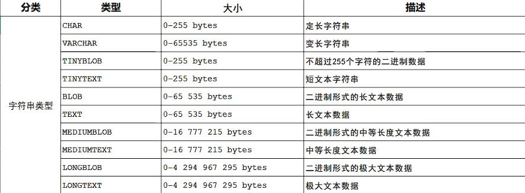
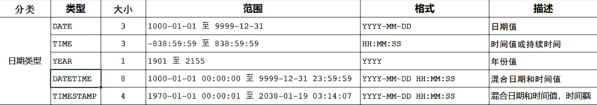
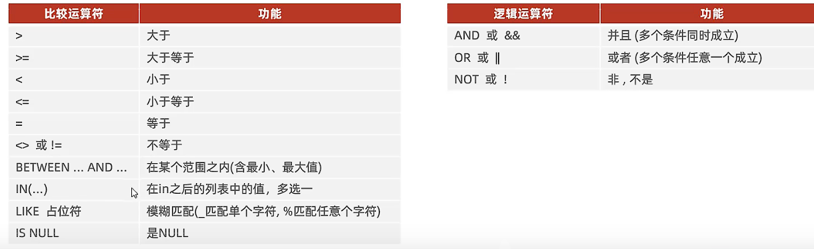
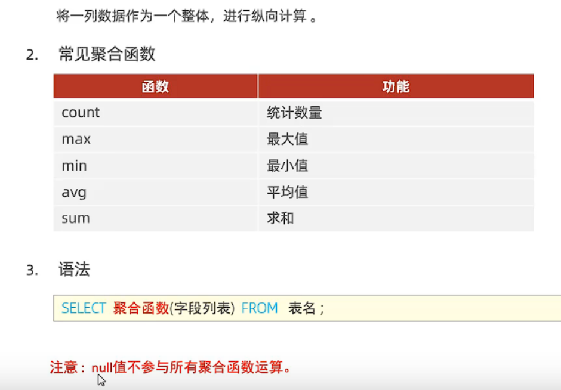

# mysql

` net start mysql80 `   启动mysql  
` net stop mysql80 `   停止mysql  

`  mysql -u root -p `   进入mysql的root账户 wt  


## DDL
> Data Definition Language

#### 查询
`show databases;` 查询所有数据库 
` select database(); `  查询当前数据库  
`show tables;`  查询当前数据库所有表  
` desc tableName_; ` 查询表结构  
`show create table tableName_; `查询指定表的建表语句  


#### 创建
`create database [if not exists] databaseName_ [default charset] [collate] ;`
```
create table tableName_(
    fieldName1_ fieldType1_ [comment 'comment_'],
    fieldName2_ fieldType2_ [comment 'comment_'],
    fieldName3_ fieldType3_ [comment 'comment_'],
    ...
    fieldNamen_ fieldTypen_ [comment 'comment_']
)[comment 'comment_'];
```
创建表  

##### 数据类型
||||
|--|--|--|
|tinyint    |1 byte|tinyint unsigned
|smallint   |2 bytes|smallint unsigned
|mediumint  |3 bytes|mediumint unsigned
|int/integer|4 bytes|int unsigned
|bigint     |8 bytes|bigint unsigned
|float      |4 bytes|float(m,d)
|double     |8 bytes|double(m,d)
|decimal||

  


  

#### 修改
`alter table tableName_ add fieldName_ fieldType_ field [comment 'comment_'] [constraint_];` 添加字段
`alter table tableName_ modify fieldName_ newFieldType_` 修改数据类型  
`alter table tableName_ change oldFieldName_ newFieldName_ fieldType_ [comment 'comment_'] [constraint_];`  修改字段名与类型  
`alter table tableName_ rename to newTableName_; ` 修改表名  


#### 删除
` drop database [if exists] databaseName_; `    删除数据库  
` drop table [if exists] tableName_; `  删除表  
` alter table tableName_ drop fieldName_;` 删除字段  
`truncate table tableName_; `   重置表,清空表数据,表结构不变  

#### 使用
` use databaseName_; `


## DML
> Data Manipulation Language

#### 添加

`insert into tableName_ (fieldName1_,fieldName2,...) values (data1_,data2_,...); `    给指定字段添加数据  
`insert into tableName_ (fieldName1_,fieldName2,...) values (data11_,data12_,...),(data21_,data22_,...),...; `    给指定字段批量添加数据  

`insert into tableName_ values (data1_,data2_,...); `    给全部字段添加数据  
`insert into tableName_ values (data1_,data2_,...),(data21_,data22_,...),...; `    给全部字段批量添加数据  

#### 修改

` update tableName_ set fieldName1_=data1,fieldName2_=data2,... [where condition_]; `   修改符合条件的数据  


#### 删除

`delete from tableName_ [where condition_];`


## DQL
> Data Query Language

```
select fileName1_ [AS nickName1_],fileName2_ [AS nickName2_],... from tableName_ [where condition_] 
[group by fileName_] [having condition_] [order by fieldName1_ asc,fieldName2_ desc,...] [limit number1_,number2_];

```

  
  

## DCL
> Data Control Language
